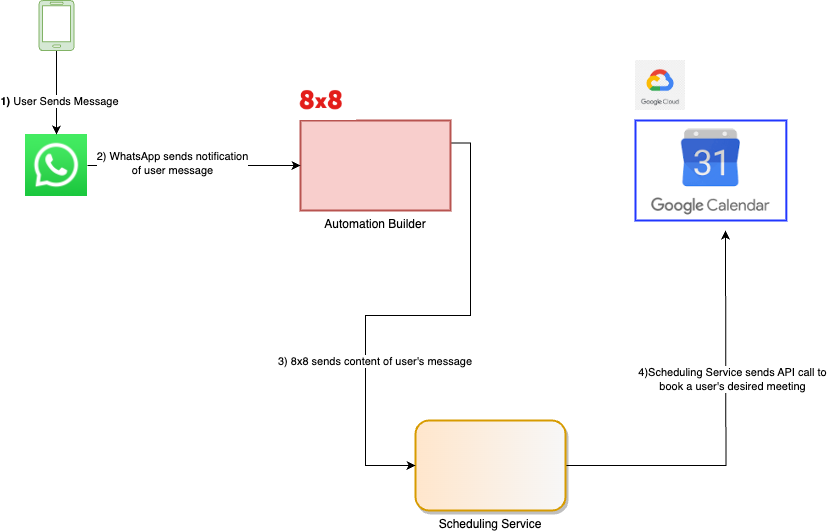

# 8x8 WhatsApp Calendar Demo

This project demos how to send Google Calendar invites through WhatsApp. It is designed to integrate with 8x8's Automation Builder. 

It consists of two components:
- Automation Builder Workflow (RS WhatsApp GCal Demo.json)
- Flask API, designed to run as a service so that the automation builder workflow can call it.

## Architecture

This service sits in between Google Calendar API and 8x8's Automation Builder to provide coordination between the two services in order to book a meeting.

The flow below is simplified as there are at least 2 API calls to Google Cloud, one to find free timeslots and then one to book a timeslot.

However there are also potential calls to generate a user token and also potentially multiple calls to check for free meeting slots.


## Prerequisites

Before you can run this project, make sure you have the following prerequisites installed on your system:

1. **Python**: This project is built using Python. You'll need Python installed on your machine. You can download Python from the [official Python website](https://www.python.org/downloads/).

2. **Python Packages**: Install the necessary Python packages using pip. Open your terminal or command prompt and run the following command:

   ```bash
   pip install -r requirements.txt
   ```

   This will install all the required packages listed in the `requirements.txt` file.

3. **Google Calendar API Credentials**: To interact with Google Calendar, you'll need to set up Google API credentials. Follow the instructions in the [Google Calendar Python Quickstart](https://developers.google.com/calendar/quickstart/python) to create and download your API credentials. Save the credentials as `google_api_creds.json` file in the project directory.

In addition, place your Google Account that you plan to use in `config.py`.


## Running the Flask Server

To run the Flask server locally, follow these steps:

1. Make sure you have completed the prerequisite steps, including installing Python packages and setting up API credentials.

2. Open your terminal or command prompt and navigate to the project directory.

3. Run the Flask server with the following command:

   ```bash
   python app.py
   ```

   This will start the Flask server, and you'll see output indicating that the server is running.

4. Open a web browser and access the server at `http://localhost:5000` (you can change the port in `api.py` if needed.)

To run the Flask server remotely, import this project into your chosen hosting infrastructure. It is assumed you have the necessary expertise to publically expose the API from that infrastructure and is beyond the scope of this guide.

## Usage

1. Run this service either locally or remotely on a server, ensure this service is accessible to the public internet.

2. Import the JSON into a workflow. Change the http steps to point to your server URL instead.

## Contributing

Contributions to this project are welcome. If you encounter issues or have suggestions for improvements, please open an issue on the GitHub repository.

## License

This project is licensed under the MIT License. See the [LICENSE](LICENSE) file for details.